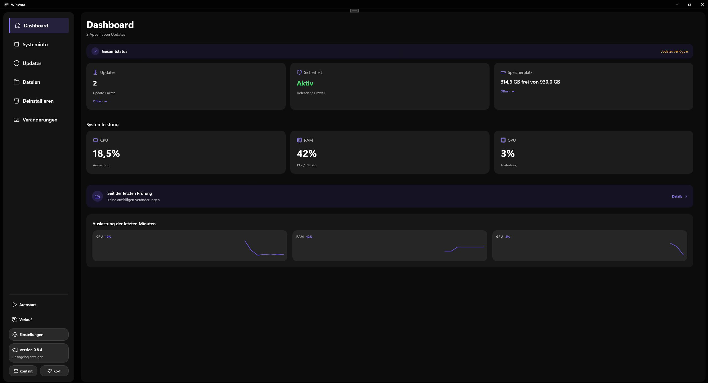
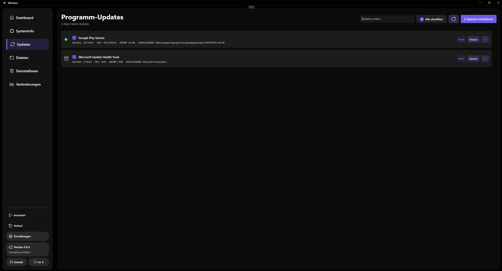
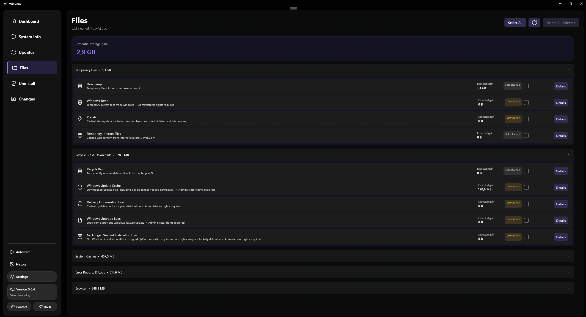
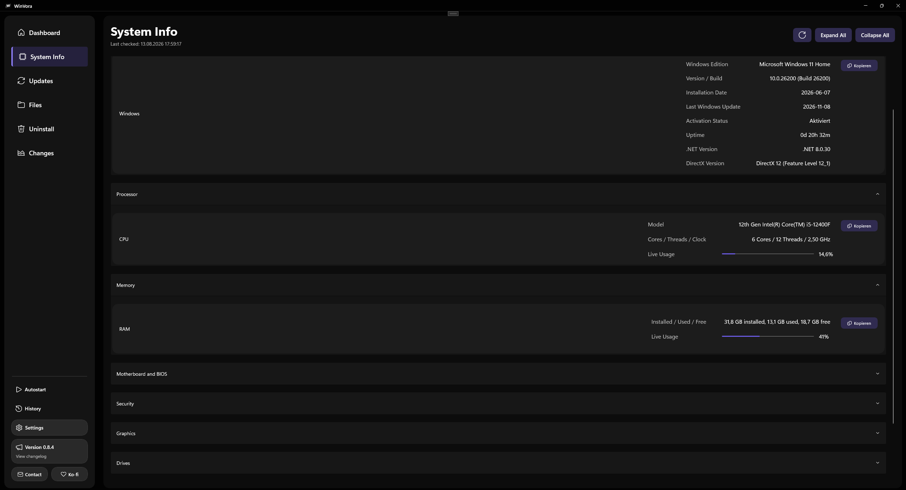

<div align="center">

# WinVora

**Windows einfacher aktualisieren, aufräumen und im Blick behalten.**

[](https://github.com/WinVora/WinVora-Releases/releases/latest)
[](#systemanforderungen)
[](#)

[**WinVora herunterladen**](https://github.com/WinVora/WinVora-Releases/releases/latest) · [Quellcode ansehen](https://github.com/WinVora/WinVora) · [Problem melden](https://github.com/WinVora/WinVora-Releases/issues)

</div>

WinVora bündelt wichtige Windows-Werkzeuge in einer übersichtlichen App. Programme aktualisieren, Speicher freigeben, Autostarts verwalten und Systeminformationen prüfen – ohne sich durch verschiedene Windows-Menüs oder technische Konsolen arbeiten zu müssen.

## Ein erster Blick



<table>
  <tr>
    <td width="50%"></td>
    <td width="50%"></td>
  </tr>
  <tr>
    <td align="center"><b>Programm-Updates</b></td>
    <td align="center"><b>Dateibereinigung</b></td>
  </tr>
</table>



## Was WinVora kann

### Programme aktuell halten

- Verfügbare Updates übersichtlich anzeigen und gemeinsam installieren
- Aktuelle und neue Version, Größe, Herausgeber und Installationsquelle einsehen
- Einzelne Programme dauerhaft ignorieren oder später aktualisieren
- Download-, Installations- und Abschlussstatus verständlich verfolgen
- Fehlgeschlagene Updates einzeln erneut versuchen
- Neustarts möglichst unterdrücken und als „Neustart erforderlich“ melden

### Windows aufräumen

- Temporäre Dateien, System-Caches, Fehlerberichte und Browserdaten untersuchen
- Erwarteten Speichergewinn vor dem Löschen anzeigen
- Empfindliche Bereiche klar kennzeichnen und gesondert absichern
- Nur die gewünschten Kategorien auswählen und kontrolliert bereinigen

### System verstehen

- CPU, RAM, GPU, Laufwerke, Netzwerk und Windows-Daten anzeigen
- Defender, Firewall, TPM und Secure Boot getrennt prüfen
- Systeminformationen kopieren und als Bericht exportieren
- Veränderungen seit der letzten Prüfung erkennen
- Ungewöhnlich stark wachsende Programme oder Ordner sichtbar machen

### Programme verwalten

- Installierte Programme suchen, exportieren und deinstallieren
- Autostart-Einträge aktivieren oder deaktivieren
- Update- und Aktivitätsverlauf mit verständlichen Ergebnissen durchsuchen
- Einstellungen, Diagnoseberichte und Sicherungen exportieren

## Installation

1. Öffne die Seite [**Neueste Version**](https://github.com/WinVora/WinVora-Releases/releases/latest).
2. Lade die Datei `WinVora-Setup-x.x.x.exe` herunter.
3. Starte den Installer und folge den angezeigten Schritten.

WinVora enthält keine zusätzliche Software und keine Werbung. Administratorrechte werden nur angefordert, wenn Windows sie für eine ausgewählte Aktion benötigt.

> **Hinweis zu Windows SmartScreen:** Der Installer ist derzeit noch nicht mit einem kostenpflichtigen Code-Signing-Zertifikat signiert. Deshalb kann Windows beim ersten Start „Unbekannter Herausgeber“ anzeigen. Lade WinVora ausschließlich aus diesem offiziellen Repository herunter.

## Sicherheit und Datenschutz

- Keine Telemetrie und kein Verkauf persönlicher Daten
- Keine versteckten Hintergrundinstallationen
- Lösch- und Deinstallationsaktionen werden vom Nutzer ausgelöst
- Technische Diagnoseberichte können vor dem Speichern geprüft werden
- Persönliche Angaben werden im Supportbericht anonymisiert
- Der Quellcode ist öffentlich einsehbar

### Download optional überprüfen

Zu jedem Installer wird eine kleine `.sha256.txt`-Datei angeboten. Sie ist für die Installation nicht erforderlich, ermöglicht aber eine unabhängige Prüfung des Downloads:

```powershell
Get-FileHash .\WinVora-Setup-x.x.x.exe -Algorithm SHA256
```

Der angezeigte Hash muss mit dem Inhalt der zugehörigen `.sha256.txt`-Datei übereinstimmen.

## Systemanforderungen

- Windows 10 ab Version 2004 oder Windows 11
- 64-Bit-System
- WinGet für Programm-Updates
- Internetverbindung für Updateprüfungen und Downloads

Die übrigen Bereiche von WinVora können auch ohne Internetverbindung verwendet werden.

## Hilfe und Rückmeldungen

Du hast einen Fehler gefunden oder eine Idee für WinVora? Erstelle ein [GitHub-Issue](https://github.com/WinVora/WinVora-Releases/issues) und beschreibe möglichst genau, was passiert ist.

Wenn dir WinVora gefällt und du die Weiterentwicklung unterstützen möchtest, kannst du das Projekt auch über [Ko-fi](https://ko-fi.com/winvora) unterstützen.

---

<div align="center">

Entwickelt für Windows-Nutzer, die ihr System ohne unnötige Komplexität verwalten möchten.

</div>
